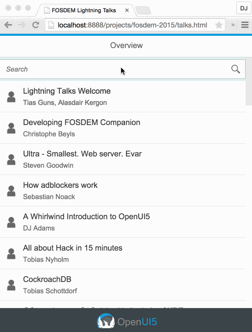

# FOSDEM 2015 OpenUI5
Assets for my FOSDEM 2015 Lightning Talk "[A Whirlwind Introduction to OpenUI5](http://lanyrd.com/2015/fosdem/sdhcrp/)".

## What This Is

I built up the [talks.html](talks.html) file during the talk,
using [some custom Atom snippets](https://github.com/qmacro/ui5-snippets/blob/fosdem-2015/snippets/fosdem-2015.cson). In the time I had for the talk, I only scraped the surface of [OpenUI5](https://github.com/SAP/openui5/) and showed these features:

- the OpenUI5 bootstrap
- Model-View-Controller support
- internationalization
- support for right-to-left languages
- screen-sized controls and navigation
- client side models and data binding
- various standard responsive controls 

Note that in this simple example, I wanted to keep all the parts in a single file, for easier demonstration. Of course, you can and should separate out your view and controller definitions into separate files.

## SearchField and Filtering

In this version here on Github you can also see filtering in action. Filtering is part of the model support, and in this case is tied to the liveChange event of the Search Field control.

## Quick Screencast

Here's a quick screencast of the app in [talks.html](talks.html):

